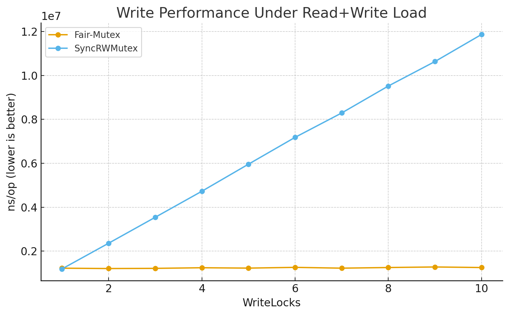

# Fair-Mutex

<div align="center">
  
</div>

[](https://goreportcard.com/report/github.com/fastbean-au/fair-mutex)
[](https://coveralls.io/github/fastbean-au/fair-mutex?branch=main)

[](https://snyk.io/test/github/fastbean-au/fair-mutex)
[](https://pkg.go.dev/github.com/fastbean-au/fair-mutex)


**fair-mutex** is a Go implementation of a fair RW mutex; that is, a mutex where write locks will not be prevented in a high volume read-lock use case. The larger the number of write locks required, the larger the performance benefit over `sync.RWMutex`. This is perhaps a fairly narrow use-case; if you don't need this then consider using [go-lock](https://github.com/viney-shih/go-lock) if the built-in `sync.RWMutex` or `sync.Mutex` do not meet your needs. To see if **fair-mutex** might meet your needs, start by looking at the benchmark results.

<div align="center">
  
</div>

This implementation can be used as *functional* a drop-in replacement for Go's [`sync.RWMutex`](https://pkg.go.dev/sync#RWMutex) or [`sync.Mutex`](https://pkg.go.dev/sync#Mutex) as at Go 1.25 (with limitations - please see below). (*Note:* the `New()` function must be called to initialise the mutex prior to use, and the `Stop()` method must be called in order to release the resources associated with the mutex. *NB*: calling any method on the mutex after calling `Stop()` will result in a panic).

The general principle on which **fair-mutex** operates is that locks are given in batches alternating between write locks and read locks. The batch size is determined at the beginning of a locking cycle based on the number of requests for locks. Read locks are given concurrently for the entire batch, white write locks are given sequentially for the entire batch. While batches are being processed, both type of lock requests are queued. Batch sizes are simply the lesser of the number of locks queued of the lock type at the beginning of a cycle or the maximum size limit set for that lock type. So, in practice, what this means is that read locks are not automatically given if there is no write lock taken.

An OpenTelemetry (OTEL) metric is provided to record the lock wait times, allowing an evaluation of the effective performance of the mutex, and identification of problematic lock contention issues.

## Limitations

Because of the way that **fair-mutex** batches locking, there is a scenario where it can cause a deadlock. This scenario is exposed by the `sync.RWMutex` unit test [doParallelReaders](https://cs.opensource.google/go/go/+/master:src/sync/rwmutex_test.go;l=28) when modified to run **fair-mutex**. Briefly, this occurs when a set of locks must be granted before any locks are released. To overcome this limitation, use the `RLockSet(n)` method to request a set of read locks. No matter how many read locks are requested in a set, only the set itself counts towards the batch limit.

Like `sync.Mutex` or `sync.RWMutex`, **fair-mutex** cannot be safely copied; however, unlike `sync.Mutex` and `sync.RWMutex`, **fair-mutex** cannot be copied at any time.

## Configuration options

**fair-mutex**  provides configurable read and write queue and batch size options, as well as an options for the metric name and default metric attributes.

### WithMaxReadBatchSize
The maximum batch size for read (also known as shared) locks. The batch size does not determine the number of calls to obtain a lock that are waiting, but the maximum number that will be processed in one locking cycle.

This value cannot be larger than the MaxReadQueueSize.

Defaults to the value of MaxReadQueueSize.

### WithMaxReadQueueSize
The maximum queue size for read (also known as shared) locks. The queue size does not determine the number of calls to obtain a lock that are waiting, but the number during which we can guarantee order. This setting will effect the memory required.

Set to 1 if this mutex will only be used as a write-only mutex (but you probably don't want to do that).

Defaults to 1024.

### WithMaxWriteBatchSize
The maximum batch size for write (also known as exclusive) locks. The batch size does not determine the number of calls to obtain a lock that are waiting, but the maximum number that will be processed in one locking cycle.

This value cannot be larger than the MaxWriteQueueSize.

Defaults to 32.

### WithMaxWriteQueueSize
The maximum queue size for write (also known as exclusive) locks. The queue size does not determine the number of calls to obtain a lock that are waiting, but the number during which we can guarantee order. This setting will effect the memory required.

Defaults to 256.

### WithMetricAttributes
A set of attributes with pre-set values to provide on every recording of the mutex lock wait time metric.

WithMetricName - name for the metric.

Defaults to "go.mutex.wait.seconds".

## Installation

```bash
go get github.com/fastbean-au/fair-mutex
```

## Example usage

```bash
package main

import (
	"fmt"
	"math/rand/v2"
	"sync"
	"time"

	fairmutex "github.com/fastbean-au/fair-mutex"
)

func main() {

	mtx := fairmutex.New()

	mtx.Lock()
	// Do something
	mtx.Unlock()

	mtx.RLock()
	// Do something
	mtx.RUnlock()

	<-time.After(time.Millisecond)

	if !mtx.TryLock() {
		fmt.Println("Couldn't get a lock")
	} else {
		fmt.Println("Have a lock")
		mtx.Unlock()
	}

	<-time.After(time.Millisecond)

	if !mtx.TryRLock() {
		fmt.Println("Couldn't get a read lock")
	} else {
		fmt.Println("Have a read lock")
		mtx.RUnlock()
	}

	wg := new(sync.WaitGroup)

	for range 1000 {
		wg.Add(1)
		go func() {
			defer wg.Done()
			if rand.IntN(5) == 4 {
				mtx.Lock()
				defer mtx.Unlock()
				<-time.After(time.Millisecond)
			} else {
				mtx.RLock()
				defer mtx.RUnlock()
				<-time.After(time.Millisecond)
			}
		}()
	}

	wg.Wait()

    // Stop the mutex to release the resources
	mtx.Stop()
}
```

### Benchmarks

Side-by-side comparison of `fair-mutex` and `sync.RWMutex`.

A note on the WriteLocks benchmarks: the read locks are being held for 1ms. The `NS/Operation` time includes that time.


| Test                                            | Operations | NS/Operation | Memory Bytes/Op | Memory Allocs/Op |
| ----------------------------------------------- | ---------: | -----------: | --------------: | ---------------: |
| Fair-Mutex Read                                 |    895,989 |        1,232 |             448 |                7 |
| SyncRWMutex Read                                | 83,635,585 |        14.02 |               0 |                0 |
|                                                 |            |              |                 |                  |
| Fair-Mutex Write                                |    888,465 |        1,215 |             448 |                7 |
| SyncRWMutex Write                               | 63,250,966 |        18.52 |               0 |                0 |
|                                                 |            |              |                 |                  |
| Fair-Mutex UnderReadLoadWithGaps                |     10,768 |      174,686 |             549 |                8 |
| SyncRWMutex UnderReadLoadWithGaps               |      1,065 |    1,147,626 |             247 |                2 |
|                                                 |            |              |                 |                  |
| Fair-Mutex UnderReadAndWriteLoad/WriteLocks=1   |      1,051 |    1,191,007 |           3,977 |               57 |
| SyncRWMutex UnderReadAndWriteLoad/WriteLocks=1  |      1,036 |    1,180,587 |           2,242 |               28 |
|                                                 |            |              |                 |                  |
| Fair-Mutex UnderReadAndWriteLoad/WriteLocks=2   |      1,015 |    1,197,810 |           4,847 |               70 |
| SyncRWMutex UnderReadAndWriteLoad/WriteLocks=2  |        508 |    2,382,394 |           4,570 |               57 |
|                                                 |            |              |                 |                  |
| Fair-Mutex UnderReadAndWriteLoad/WriteLocks=3   |      1,014 |    1,215,618 |           5,718 |               84 |
| SyncRWMutex UnderReadAndWriteLoad/WriteLocks=3  |        338 |    3,546,250 |           6,597 |               82 |
|                                                 |            |              |                 |                  |
| Fair-Mutex UnderReadAndWriteLoad/WriteLocks=4   |      1,016 |    1,212,434 |           6,291 |               93 |
| SyncRWMutex UnderReadAndWriteLoad/WriteLocks=4  |        252 |    4,747,387 |           8,725 |              109 |
|                                                 |            |              |                 |                  |
| Fair-Mutex UnderReadAndWriteLoad/WriteLocks=5   |      1,008 |    1,207,242 |           6,775 |              101 |
| SyncRWMutex UnderReadAndWriteLoad/WriteLocks=5  |        201 |    5,909,682 |          10,914 |              136 |
|                                                 |            |              |                 |                  |
| Fair-Mutex UnderReadAndWriteLoad/WriteLocks=6   |        973 |    1,237,701 |           7,460 |              112 |
| SyncRWMutex UnderReadAndWriteLoad/WriteLocks=6  |        170 |    7,081,535 |          13,128 |              163 |
|                                                 |            |              |                 |                  |
| Fair-Mutex UnderReadAndWriteLoad/WriteLocks=7   |      1,004 |    1,222,311 |           7,895 |              119 |
| SyncRWMutex UnderReadAndWriteLoad/WriteLocks=7  |        144 |    8,192,802 |          15,318 |              191 |
|                                                 |            |              |                 |                  |
| Fair-Mutex UnderReadAndWriteLoad/WriteLocks=8   |        992 |    1,232,482 |           8,412 |              128 |
| SyncRWMutex UnderReadAndWriteLoad/WriteLocks=8  |        126 |    9,369,983 |          16,883 |              210 |
|                                                 |            |              |                 |                  |
| Fair-Mutex UnderReadAndWriteLoad/WriteLocks=9   |        991 |    1,241,530 |           8,915 |              137 |
| SyncRWMutex UnderReadAndWriteLoad/WriteLocks=9  |        100 |   10,659,486 |          20,575 |              256 |
|                                                 |            |              |                 |                  |
| Fair-Mutex UnderReadAndWriteLoad/WriteLocks=10  |        994 |    1,242,866 |           9,397 |              145 |
| SyncRWMutex UnderReadAndWriteLoad/WriteLocks=10 |        100 |   11,749,459 |          21,634 |              269 |
