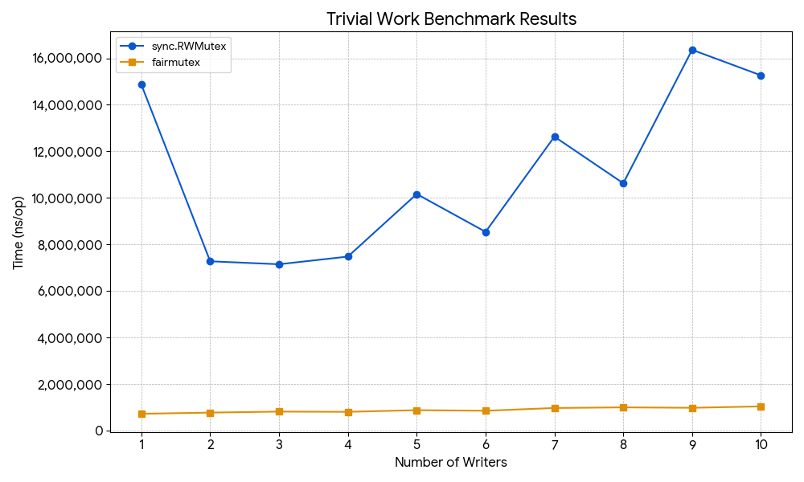
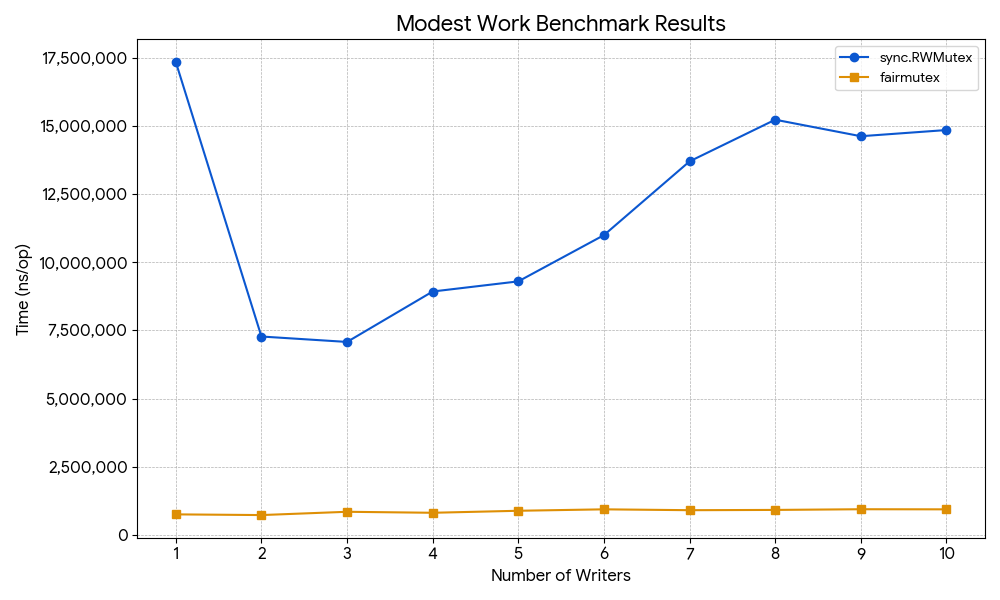

# Fair-Mutex

<div align="center">
  
</div>

[](https://goreportcard.com/report/github.com/fastbean-au/fair-mutex)
[](https://coveralls.io/github/fastbean-au/fair-mutex?branch=main)

[](https://snyk.io/test/github/fastbean-au/fair-mutex)
[](https://pkg.go.dev/github.com/fastbean-au/fair-mutex)


**fair-mutex** is a Fair RW Mutex for Go.

`fair-mutex` is a mutex where write locks will not be significantly delayed in a high volume read-lock use case, while providing a limited guarantee of honouring lock request ordering (see below in [limitations](#limitations)). The larger the number of write locks required under a persistent read lock demand, the larger the performance benefit over `sync.RWMutex` that can be seen (and this is the only scenario where you might see a performance benefit - in **all** other cases `fair-mutex` *will* be less performant).

These are perhaps fairly specific use-cases; if you do not need either of these, then you would perhaps be better off using `sync.RWMutex` or `sync.Mutex` , and if those don't quite meet your needs, then [go-lock](https://github.com/viney-shih/go-lock) might also be an alternative to consider.

This implementation can be used as *functional* a drop-in replacement for Go's [`sync.RWMutex`](https://pkg.go.dev/sync#RWMutex) or [`sync.Mutex`](https://pkg.go.dev/sync#Mutex) as at Go 1.25 (with [limitations](#limitations)).

In addition to supporting the methods provided by `sync.RWMutex`, a helper method `RLockSet(int)` is provided to facilitate requesting a set of read locks in a single batch.

Two properties, `HasQueueBeenExceeded` and `HasRQueueBeenExceeded` are also made available to assist in identifying when ordering guarantees have not been able to be maintained with the configuration of queue sizes used. If lock request ordering is significant for you, you may wish to check one or both of these properties  as applicable either periodically, or at the conclusion of using the mutex to determine if queue sizes need to be increased.

## How it works

The general principle on which `fair-mutex` operates is that locks are given in batches alternating between write locks and read locks when both types of lock requests are queued. When no locks are queued, the first request received of either type becomes the type for that batch.

The batch size is determined at the beginning of a locking cycle, and are simply the lesser of the number of locks queued of the lock type at the beginning of a cycle or the maximum size limit set for that lock type.

Read locks are given concurrently for the entire batch, white write locks are given (and returned) sequentially for the entire batch.

While batches are being processed, both type of lock requests are queued.

Additionally, an OpenTelemetry (OTEL) metric is provided to record the lock wait times, allowing an evaluation of the effective performance of the mutex, and identification of problematic lock contention issues.

### An example

Where R is a R(ead) lock and W is a W(rite) lock request.

Given a starting write lock with lock requests queued as below:

R<sub>1</sub> R<sub>2</sub> R<sub>3</sub> R<sub>4</sub> W<sub>1</sub> W<sub>2</sub> R<sub>5</sub> R<sub>6</sub> R<sub>7</sub> W<sub>3</sub> R<sub>8</sub> W<sub>4</sub> W<sub>5</sub> W<sub>6</sub> R<sub>9</sub> R<sub>10</sub> R<sub>11</sub> R<sub>12</sub> R<sub>13</sub> R<sub>14</sub> W<sub>7</sub> W<sub>8</sub> W<sub>9</sub> W<sub>10</sub> R<sub>15</sub> R<sub>16</sub> R<sub>17</sub>

Locks would expect to be issued as follows once the initial lock is unlocked (the initial lock was a write lock, so the next batch would attempt to be a batch of read locks):

Batch 1: [R<sub>1</sub> R<sub>2</sub> R<sub>3</sub> R<sub>4</sub> R<sub>5</sub> R<sub>6</sub> R<sub>7</sub> R<sub>8</sub> R<sub>9</sub> R<sub>10</sub> R<sub>11</sub> R<sub>12</sub> R<sub>13</sub> R<sub>14</sub> R<sub>15</sub> R<sub>16</sub> R<sub>17</sub>]

Batch 2: [

W<sub>1</sub>

W<sub>2</sub>

W<sub>3</sub>

W<sub>4</sub>

W<sub>5</sub>

W<sub>6</sub>

W<sub>7</sub>

W<sub>8</sub>

W<sub>9</sub>

W<sub>10</sub>

]


## Installation

```bash
go get github.com/fastbean-au/fair-mutex
```

## Usage

*Note:* The `New()` function must be called to initialise the mutex prior to use, and the `Stop()` method must be called in order to release the resources associated with the mutex.

*NB*: Calling any method on the mutex after calling `Stop()` will result in a panic.

### Example usage

```go
package main

import (
	"fmt"
	"math/rand/v2"
	"sync"
	"time"

	fairmutex "github.com/fastbean-au/fair-mutex"
)

func main() {

	mtx := fairmutex.New()
	defer mtx.Stop() // Stop the mutex to release the resources

	mtx.Lock()
	// Do something
	mtx.Unlock()

	mtx.RLock()
	// Do something
	mtx.RUnlock()

	if !mtx.TryLock() {
		fmt.Println("Couldn't get a lock")
	} else {
		fmt.Println("Have a lock")
		mtx.Unlock()
	}

	if !mtx.TryRLock() {
		fmt.Println("Couldn't get a read lock")
	} else {
		fmt.Println("Have a read lock")
		mtx.RUnlock()
	}

	wg := new(sync.WaitGroup)

	for range 1000 {
		wg.Add(1)
		go func() {
			defer wg.Done()
			if rand.IntN(5) == 4 {
				mtx.Lock()
				defer mtx.Unlock()
				<-time.After(time.Millisecond)
			} else {
				mtx.RLock()
				defer mtx.RUnlock()
				<-time.After(time.Millisecond)
			}
		}()
	}

	wg.Wait()
}
```

### Example Usage - Ordered Mutex (write locks only)

```go
package main

import (
	"fmt"

	fairmutex "github.com/fastbean-au/fair-mutex"
)

func main() {
	mtx := fairmutex.New(fairmutex.WithMaxReadQueueSize(1))
	defer mtx.Stop() // Stop the mutex to release the resources

	// Lock the mutex initially to allow lock requests to be queued
	mtx.Lock()

	for i := 0; i < 10; i++ {
		go func() {
			mtx.Lock()
			defer mtx.Unlock()

			fmt.Println(i)
		}()
	}

	mtx.Unlock()

	// Wait here for a bit to allow the go funcs to acquire and release the locks
	<-time.After(time.Second)
}
```

### Example Usage - Ordered Mutex (read locks only)

*Note:* while read locks are issued in the order requested within the limits of the queue length, if the order is an absolute requirement, the only effective way to achieve it is as below - with a read batch size of 1, which, in effect is the same as using a write lock.

```go
package main

import (
	"fmt"

	fairmutex "github.com/fastbean-au/fair-mutex"
)

func main() {
	mtx := fairmutex.New(
			fairmutex.WithMaxReadBatchSize(1),
			fairmutex.WithMaxWriteQueueSize(1),
	)
	defer mtx.Stop() // Stop the mutex to release the resources

	// Lock the mutex initially to allow lock requests to be queued
	mtx.Lock()

	for i := 0; i < 10; i++ {
		go func() {
			mtx.RLock()
			defer mtx.RUnlock()

			fmt.Println(i)
		}()
	}

	mtx.Unlock()

	// Wait here for a bit to allow the go funcs to acquire and release the locks
	<-time.After(time.Second)
}
```

## Limitations

1. Because of the way that `fair-mutex` batches locking, there is a scenario where it can cause a deadlock. This scenario is exposed by the `sync.RWMutex` unit test [doParallelReaders](https://cs.opensource.google/go/go/+/master:src/sync/rwmutex_test.go;l=28) when modified to run `fair-mutex`. Briefly, this occurs when a set of locks must be granted before any locks are released. To overcome this limitation, use the `RLockSet(n)` method to request a set of read locks. No matter how many read locks are requested in a set, only the set itself counts towards the batch limit.

2. Like `sync.Mutex` or `sync.RWMutex`, `fair-mutex` cannot be safely copied at any time. Attempts to copy a `fair-mutex` mutex will be highlighted by `go vet`.

3. The ordering of locks is maintained as long as the number of locks of a type being requested does not exceed the queue size for that type of lock. Once exceeded, the ordering is no longer guaranteed until a new batch begins with the queue not in an overflow state.

## Configuration options

`fair-mutex` provides configurable read and write queue and batch size options, as well as an options for the metric name and default metric attributes.

### WithMaxReadBatchSize
The maximum batch size for read (also known as shared) locks. The batch size does not determine the number of calls to obtain a lock that are waiting, but the maximum number that will be processed in one locking cycle.

This value cannot be larger than the MaxReadQueueSize.

Minimum value of 1.

Defaults to the value of MaxReadQueueSize.

### WithMaxReadQueueSize
The maximum queue size for read (also known as shared) locks. The queue size does not determine the number of calls to obtain a lock that are waiting, but the number during which we can guarantee order. This setting will effect the memory required.

Set to 0 if this mutex will only be used as a write-only mutex (read locks are still permissible, but memory is reduced to a minimum).

Defaults to 1024.

### WithMaxWriteBatchSize
The maximum batch size for write (also known as exclusive) locks. The batch size does not determine the number of calls to obtain a lock that are waiting, but the maximum number that will be processed in one locking cycle.

This value cannot be larger than the MaxWriteQueueSize.

Minimum value of 1.

Defaults to 32.

### WithMaxWriteQueueSize
The maximum queue size for write (also known as exclusive) locks. The queue size does not determine the number of calls to obtain a lock that are waiting, but the number during which we can guarantee order. This setting will effect the memory required.

Defaults to 256.

### WithMetricAttributes
A set of attributes with pre-set values to provide on every recording of the mutex lock wait time metric.

### WithMetricName

The name for the metric.

Defaults to "go.mutex.wait.seconds".

## Go Benchmark Results: `sync.RWMutex` vs `fairmutex`

<div align="center">
  
  
</div>

### Overview

The following benchmarks compare the performance of `sync.RWMutex` and `fairmutex` under read and write contention with **Trivial** and **Modest** work per operation. All benchmarks were run with varying numbers of concurrent readers or writers (1–10) on an 8-core system.

Metrics shown:

- **Iterations** (higher = more stable result)
- **ns/op** = average nanoseconds per operation (lower is better)

---

#### Trivial Readers

| Readers | sync.RWMutex (ns/op) | sync.RWMutex (iters) | fairmutex (ns/op) | fairmutex (iters) |
|--------|----------------------|----------------------|-------------------|-------------------|
| 1      | 71,387               | 15,393               | 2,068,023         | 560               |
| 2      | 170,750              | 9,316                | 2,247,204         | 500               |
| 3      | 342,880              | 4,084                | 2,071,890         | 495               |
| 4      | 354,638              | 3,127                | 2,166,477         | 501               |
| 5      | 594,191              | 2,258                | 2,227,330         | 474               |
| 6      | 570,264              | 2,373                | 2,139,925         | 584               |
| 7      | 731,147              | 1,696                | 2,187,649         | 582               |
| 8      | 755,529              | 1,726                | 2,104,850         | 589               |
| 9      | 952,063              | 1,410                | 2,194,007         | 530               |
| 10     | 877,765              | 1,218                | 2,239,112         | 540               |

---

#### Modest Readers

| Readers | sync.RWMutex (ns/op) | sync.RWMutex (iters) | fairmutex (ns/op) | fairmutex (iters) |
|--------|----------------------|----------------------|-------------------|-------------------|
| 1      | 58,027               | 20,646               | 1,885,479         | 554               |
| 2      | 156,849              | 8,422                | 1,919,078         | 852               |
| 3      | 176,630              | 7,348                | 2,191,179         | 507               |
| 4      | 135,049              | 8,884                | 1,753,620         | 782               |
| 5      | 120,680              | 10,592               | 1,656,292         | 610               |
| 6      | 129,623              | 8,719                | 1,271,239         | 829               |
| 7      | 151,856              | 8,761                | 1,078,044         | 1,015             |
| 8      | 139,373              | 10,000               | 905,072           | 1,140             |
| 9      | 139,517              | 8,458                | 858,912           | 1,417             |
| 10     | 127,528              | 10,000               | 797,771           | 1,899             |

---

#### Trivial Writers

| Writers | sync.RWMutex (ns/op) | sync.RWMutex (iters) | fairmutex (ns/op) | fairmutex (iters) |
|---------|----------------------|----------------------|-------------------|-------------------|
| 1       | 14,791,490           | 120                  | 746,416           | 1,430             |
| 2       | 7,786,349            | 162                  | 751,823           | 1,560             |
| 3       | 6,775,873            | 156                  | 813,926           | 1,264             |
| 4       | 7,464,469            | 162                  | 876,813           | 1,484             |
| 5       | 12,431,794           | 129                  | 892,349           | 1,558             |
| 6       | 11,465,916           | 134                  | 936,943           | 1,335             |
| 7       | 10,068,969           | 144                  | 948,705           | 1,244             |
| 8       | 12,624,012           | 100                  | 990,205           | 1,386             |
| 9       | 13,319,460           | 100                  | 965,553           | 1,089             |
| 10      | 14,599,778           | 100                  | 1,024,979         | 1,020             |

---

#### Modest Writers

| Writers | sync.RWMutex (ns/op) | sync.RWMutex (iters) | fairmutex (ns/op) | fairmutex (iters) |
|---------|----------------------|----------------------|-------------------|-------------------|
| 1       | 10,924,570           | 601                  | 770,237           | 1,796             |
| 2       | 8,361,460            | 214                  | 765,214           | 1,622             |
| 3       | 6,664,625            | 164                  | 840,543           | 1,368             |
| 4       | 9,111,152            | 177                  | 820,902           | 1,494             |
| 5       | 7,132,459            | 141                  | 893,106           | 1,435             |
| 6       | 11,637,746           | 100                  | 890,071           | 1,444             |
| 7       | 11,830,056           | 100                  | 902,716           | 1,521             |
| 8       | 11,588,830           | 100                  | 938,670           | 1,138             |
| 9       | 14,063,770           | 96                   | 960,568           | 1,530             |
| 10      | 15,817,532           | 100                  | 902,018           | 1,200             |

---

## Key Observations

### Readers

- **`sync.RWMutex` dominates** in both Trivial and Modest read-heavy workloads.
- `fairmutex` is **~20–30x slower** under read contention due to fairness overhead.
- As reader count increases, `sync.RWMutex` scales better; `fairmutex` remains flat but high-latency.

### Writers

- **`fairmutex` wins decisively** in write-heavy scenarios — **10–20x faster** than `sync.RWMutex`.
- `sync.RWMutex` suffers from writer starvation and lock contention; performance degrades sharply.
- `fairmutex` maintains **consistent ~750k–1M ns/op** even at high writer counts.

### Trade-off Summary

| Scenario                  | Winner          | Reason |
|---------------------------|-----------------|--------|
| Read-heavy (Trivial/Modest) | `sync.RWMutex`  | Low overhead, excellent scalability |
| Write-heavy (Trivial/Modest)| `fairmutex`     | Prevents starvation, consistent latency |
| Mixed or fairness-critical | `fairmutex`     | Guarantees progress for all threads |

---

**Conclusion**:

Use **`sync.RWMutex`** for **read-dominant** workloads.

Use **`fairmutex`** for **write-heavy or fairness-sensitive** applications where preventing writer starvation is critical.
