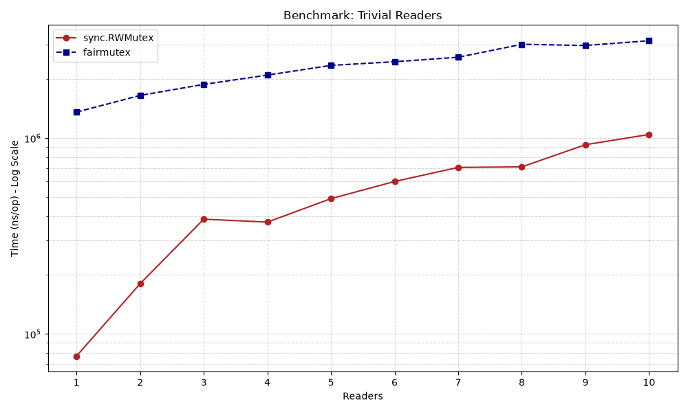
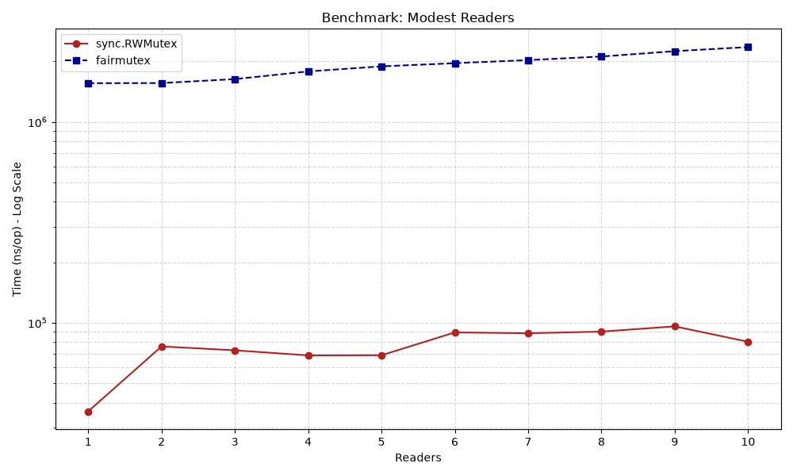
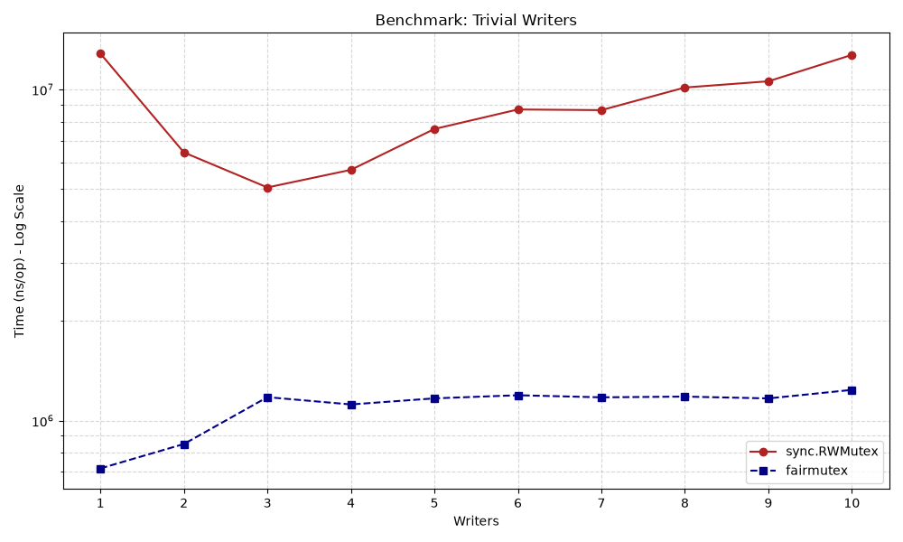
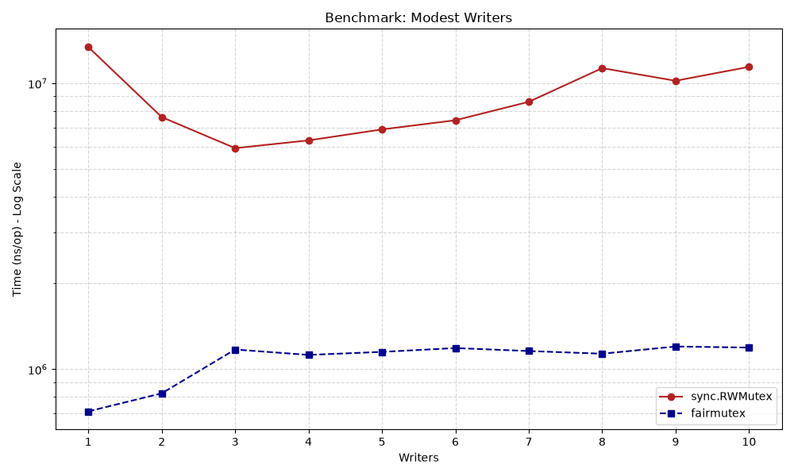

# Fair-Mutex

<div align="center">
  
</div>

[](https://goreportcard.com/report/github.com/fastbean-au/fair-mutex)
[](https://coveralls.io/github/fastbean-au/fair-mutex?branch=main)

[](https://snyk.io/test/github/fastbean-au/fair-mutex)
[](https://pkg.go.dev/github.com/fastbean-au/fair-mutex)


**fair-mutex** is a Fair RW Mutex for Go.

`fair-mutex` is a mutex where write locks will not be significantly delayed in a high volume read-lock use case, while providing a limited guarantee of honouring lock request ordering (see below in [limitations](#limitations)). The larger the number of write locks required under a persistent read lock demand, the larger the performance benefit over `sync.RWMutex` that can be seen (and this is the only scenario where you might see a performance benefit - in **all** other cases `fair-mutex` *will* be less performant).

These are perhaps fairly specific use-cases; if you do not need either of these, then you would perhaps be better off using `sync.RWMutex` or `sync.Mutex` , and if those don't quite meet your needs, then [go-lock](https://github.com/viney-shih/go-lock) might also be an alternative to consider.

This implementation can be used as a *functional* drop-in replacement for Go's [`sync.RWMutex`](https://pkg.go.dev/sync#RWMutex) or [`sync.Mutex`](https://pkg.go.dev/sync#Mutex) as at Go 1.25 (with [limitations](#limitations)).

In addition to supporting the methods provided by `sync.RWMutex`, a helper method `RLockSet(int)` is provided to facilitate requesting a set of read locks in a single batch. It is a run-time error (a panic) to request fewer than one lock.

Two methods, `HasQueueBeenExceeded()` and `HasRQueueBeenExceeded()`, are also made available to assist in identifying when ordering guarantees have not been able to be maintained with the configuration of queue sizes used. If lock request ordering is significant for you, you may wish to check one or both of these methods as applicable either periodically, or at the conclusion of using the mutex to determine if queue sizes need to be increased.

## How it works

The general principle on which `fair-mutex` operates is that locks are given in batches alternating between write locks and read locks when both types of lock requests are queued. When no locks are queued, the first request received of either type becomes the type for that batch.

The batch size is determined at the beginning of a locking cycle, and are simply the lesser of the number of locks queued of the lock type at the beginning of a cycle or the maximum size limit set for that lock type.

Read locks are given concurrently for the entire batch, while write locks are given (and returned) sequentially for the entire batch.

While batches are being processed, both type of lock requests are queued.

Additionally, an OpenTelemetry (OTEL) metric is provided to record the lock wait times, allowing an evaluation of the effective performance of the mutex, and identification of problematic lock contention issues.

### An example

Where R is a R(ead) lock and W is a W(rite) lock request.

Given a starting write lock with lock requests queued as below:

R<sub>1</sub> R<sub>2</sub> R<sub>3</sub> R<sub>4</sub> W<sub>1</sub> W<sub>2</sub> R<sub>5</sub> R<sub>6</sub> R<sub>7</sub> W<sub>3</sub> R<sub>8</sub> W<sub>4</sub> W<sub>5</sub> W<sub>6</sub> R<sub>9</sub> R<sub>10</sub> R<sub>11</sub> R<sub>12</sub> R<sub>13</sub> R<sub>14</sub> W<sub>7</sub> W<sub>8</sub> W<sub>9</sub> W<sub>10</sub> R<sub>15</sub> R<sub>16</sub> R<sub>17</sub>

Locks would expect to be issued as follows once the initial lock is unlocked (the initial lock was a write lock, so the next batch would attempt to be a batch of read locks):

Batch 1: [R<sub>1</sub> R<sub>2</sub> R<sub>3</sub> R<sub>4</sub> R<sub>5</sub> R<sub>6</sub> R<sub>7</sub> R<sub>8</sub> R<sub>9</sub> R<sub>10</sub> R<sub>11</sub> R<sub>12</sub> R<sub>13</sub> R<sub>14</sub> R<sub>15</sub> R<sub>16</sub> R<sub>17</sub>]

Batch 2: [

W<sub>1</sub>

W<sub>2</sub>

W<sub>3</sub>

W<sub>4</sub>

W<sub>5</sub>

W<sub>6</sub>

W<sub>7</sub>

W<sub>8</sub>

W<sub>9</sub>

W<sub>10</sub>

]


## Installation

```bash
go get github.com/fastbean-au/fair-mutex
```

## Static Analysis

A companion static analyzer, `fairmutexcheck`, is included in this repository. It catches common misuse patterns at compile time:

- Direct instantiation (`fairmutex.RWMutex{}`, `&fairmutex.RWMutex{}`, `new(fairmutex.RWMutex)`) instead of `New()`
- Calling `New()` without a corresponding `Stop()` (including `Stop()` called via `defer`, or from a goroutine closure in the same function)

```bash
# Build and run as a standalone checker
go build -o fairmutexcheck ./cmd/fairmutexcheck
./fairmutexcheck ./...

# Or integrate with go vet
go vet -vettool=./fairmutexcheck ./...
```

See [`cmd/fairmutexcheck/README.md`](cmd/fairmutexcheck/README.md) for full details.

## Usage

*Note:* The `New()` function must be called to initialise the mutex prior to use, and the `Stop()` method must be called in order to release the resources associated with the mutex. `Stop()` is idempotent and safe for concurrent use, and does not return until the mutex is fully stopped.

*NB*: Calling any method on the mutex after calling `Stop()` will result in a panic. The mutex should only be stopped once all locks have been released and no lock requests are pending: any request still queued when `Stop()` is called can never be granted, and will panic rather than be left blocked forever.

### Example usage

```go
package main

import (
	"fmt"
	"math/rand/v2"
	"sync"
	"time"

	fairmutex "github.com/fastbean-au/fair-mutex"
)

func main() {

	mtx := fairmutex.New()
	defer mtx.Stop() // Stop the mutex to release the resources

	mtx.Lock()
	// Do something
	mtx.Unlock()

	mtx.RLock()
	// Do something
	mtx.RUnlock()

	if !mtx.TryLock() {
		fmt.Println("Couldn't get a lock")
	} else {
		fmt.Println("Have a lock")
		mtx.Unlock()
	}

	if !mtx.TryRLock() {
		fmt.Println("Couldn't get a read lock")
	} else {
		fmt.Println("Have a read lock")
		mtx.RUnlock()
	}

	wg := new(sync.WaitGroup)

	for range 1000 {
		wg.Add(1)
		go func() {
			defer wg.Done()
			if rand.IntN(5) == 4 {
				mtx.Lock()
				defer mtx.Unlock()
				<-time.After(time.Millisecond)
			} else {
				mtx.RLock()
				defer mtx.RUnlock()
				<-time.After(time.Millisecond)
			}
		}()
	}

	wg.Wait()
}
```

### Example Usage - Ordered Mutex (write locks only)

```go
package main

import (
	"fmt"
	"time"

	fairmutex "github.com/fastbean-au/fair-mutex"
)

func main() {
	mtx := fairmutex.New(fairmutex.WithMaxReadQueueSize(1))
	defer mtx.Stop() // Stop the mutex to release the resources

	// Lock the mutex initially to allow lock requests to be queued
	mtx.Lock()

	for i := 0; i < 10; i++ {
		go func() {
			mtx.Lock()
			defer mtx.Unlock()

			fmt.Println(i)
		}()
	}

	mtx.Unlock()

	// Wait here for a bit to allow the go funcs to acquire and release the locks
	<-time.After(time.Second)
}
```

### Example Usage - Ordered Mutex (read locks only)

*Note:* while read locks are issued in the order requested within the limits of the queue length, if the order is an absolute requirement, the only effective way to achieve it is as below - with a read batch size of 1, which, in effect is the same as using a write lock.

```go
package main

import (
	"fmt"
	"time"

	fairmutex "github.com/fastbean-au/fair-mutex"
)

func main() {
	mtx := fairmutex.New(
			fairmutex.WithMaxReadBatchSize(1),
			fairmutex.WithMaxWriteQueueSize(1),
	)
	defer mtx.Stop() // Stop the mutex to release the resources

	// Lock the mutex initially to allow lock requests to be queued
	mtx.Lock()

	for i := 0; i < 10; i++ {
		go func() {
			mtx.RLock()
			defer mtx.RUnlock()

			fmt.Println(i)
		}()
	}

	mtx.Unlock()

	// Wait here for a bit to allow the go funcs to acquire and release the locks
	<-time.After(time.Second)
}
```

## Limitations

1. Because of the way that `fair-mutex` batches locking, there is a scenario where it can cause a deadlock. This scenario is exposed by the `sync.RWMutex` unit test [doParallelReaders](https://cs.opensource.google/go/go/+/master:src/sync/rwmutex_test.go;l=28) when modified to run `fair-mutex`. Briefly, this occurs when a set of locks must be granted before any locks are released. To overcome this limitation, use the `RLockSet(n)` method to request a set of read locks. No matter how many read locks are requested in a set, only the set itself counts towards the batch limit.

2. Like `sync.Mutex` or `sync.RWMutex`, `fair-mutex` cannot be safely copied at any time. Attempts to copy a `fair-mutex` mutex will be highlighted by `go vet`.

3. The ordering of locks is maintained as long as the number of locks of a type being requested does not exceed the queue size for that type of lock. Once exceeded, the ordering is no longer guaranteed until a new batch begins with the queue not in an overflow state.

4. `TryLock` and `TryRLock` never block waiting for the lock, but their semantics are stricter than `sync.RWMutex`: they succeed only when the mutex is completely free (no locks held and no requests queued), and they may fail spuriously in the instant after the mutex becomes free. In particular, two concurrent `TryRLock` calls will not both succeed, where `sync.RWMutex` would allow both.

## Configuration options

`fair-mutex` provides configurable read and write queue and batch size options, as well as an options for the metric name and default metric attributes.

### WithMaxReadBatchSize
The maximum batch size for read (also known as shared) locks. The batch size does not determine the number of calls to obtain a lock that are waiting, but the maximum number that will be processed in one locking cycle.

This value cannot be larger than the MaxReadQueueSize.

Minimum value of 1.

Defaults to 256.

Under sustained heavy read demand, read batches will fill to this limit, and a queued write lock waits for the current read batch to complete. Reduce this value to bound write lock latency in read-heavy workloads, or increase it to favour read throughput.

### WithMaxReadQueueSize
The maximum queue size for read (also known as shared) locks. The queue size does not determine the number of calls to obtain a lock that are waiting, but the number during which we can guarantee order. This setting will effect the memory required.

Set to 1 if this mutex will only be used as a write-only mutex (read locks are still permissible, but memory is reduced to a minimum).

Values less than 1 are treated as 1.

Defaults to 1024.

### WithMaxWriteBatchSize
The maximum batch size for write (also known as exclusive) locks. The batch size does not determine the number of calls to obtain a lock that are waiting, but the maximum number that will be processed in one locking cycle.

This value cannot be larger than the MaxWriteQueueSize.

Minimum value of 1.

Defaults to 32.

### WithMaxWriteQueueSize
The maximum queue size for write (also known as exclusive) locks. The queue size does not determine the number of calls to obtain a lock that are waiting, but the number during which we can guarantee order. This setting will effect the memory required.

Values less than 1 are treated as 1.

Defaults to 256.

### WithMetricAttributes
A set of attributes with pre-set values to provide on every recording of the mutex lock wait time metric.

### WithMetricName

The name for the metric.

Defaults to "go.mutex.wait.seconds".

## Go Benchmark Results: `sync.RWMutex` vs `fairmutex`

<div align="center">
  
</div>

### Overview

The following benchmarks compare the performance of `sync.RWMutex` and `fairmutex` under read and write contention with **Trivial** and **Modest** work per operation. All benchmarks were run with varying numbers of concurrent readers or writers (1–10) on an 8-core system.

The tables and graphs below can be regenerated with [`benchmarking/genreport.py`](benchmarking/genreport.py) (requires matplotlib):

```bash
go test -bench 'Locks/.*/UnderReadAndWriteLoad_(TrivialWork|ModestWork)$' -run '^$' ./benchmarking/ > bench.out
python3 benchmarking/genreport.py   # writes assets/*.png and tables.md
```

Metrics shown:

- **Iterations** (higher = more stable result)
- **ns/op** = average nanoseconds per operation (lower is better)

---

#### Trivial Readers

| Readers | sync.RWMutex (ns/op) | sync.RWMutex (iters) | fairmutex (ns/op) | fairmutex (iters) |
|---------|----------------------|----------------------|-------------------|-------------------|
| 1 | 77,060 | 18,260 | 1,356,570 | 892 |
| 2 | 180,529 | 6,060 | 1,650,158 | 766 |
| 3 | 385,296 | 2,916 | 1,878,830 | 699 |
| 4 | 372,170 | 3,466 | 2,095,633 | 512 |
| 5 | 490,394 | 4,627 | 2,348,436 | 517 |
| 6 | 600,076 | 1,684 | 2,452,600 | 556 |
| 7 | 707,889 | 1,845 | 2,584,325 | 445 |
| 8 | 712,600 | 1,474 | 3,009,676 | 466 |
| 9 | 924,449 | 2,326 | 2,967,786 | 417 |
| 10 | 1,042,754 | 1,230 | 3,139,224 | 382 |

<div align="center">
  
</div>

---

#### Modest Readers

| Readers | sync.RWMutex (ns/op) | sync.RWMutex (iters) | fairmutex (ns/op) | fairmutex (iters) |
|---------|----------------------|----------------------|-------------------|-------------------|
| 1 | 55,667 | 18,386 | 1,581,790 | 903 |
| 2 | 138,726 | 8,911 | 1,265,796 | 908 |
| 3 | 199,949 | 5,846 | 1,797,424 | 723 |
| 4 | 224,235 | 4,806 | 1,945,951 | 657 |
| 5 | 140,062 | 8,810 | 1,993,500 | 628 |
| 6 | 175,165 | 8,455 | 2,067,703 | 595 |
| 7 | 120,316 | 9,614 | 2,134,920 | 537 |
| 8 | 170,727 | 6,745 | 2,274,746 | 714 |
| 9 | 165,430 | 10,000 | 2,356,042 | 511 |
| 10 | 148,980 | 10,000 | 2,414,398 | 494 |

<div align="center">
  
</div>

---

#### Trivial Writers

| Writers | sync.RWMutex (ns/op) | sync.RWMutex (iters) | fairmutex (ns/op) | fairmutex (iters) |
|---------|----------------------|----------------------|-------------------|-------------------|
| 1 | 11,144,973 | 100 | 193,662 | 6,057 |
| 2 | 5,844,347 | 188 | 234,962 | 5,750 |
| 3 | 5,623,971 | 229 | 325,049 | 3,688 |
| 4 | 5,486,612 | 214 | 333,700 | 3,836 |
| 5 | 7,580,627 | 188 | 341,747 | 3,746 |
| 6 | 8,440,267 | 150 | 340,918 | 3,544 |
| 7 | 10,380,412 | 100 | 342,859 | 3,175 |
| 8 | 10,639,926 | 100 | 353,143 | 3,321 |
| 9 | 10,945,730 | 100 | 362,281 | 3,674 |
| 10 | 15,736,136 | 100 | 366,223 | 3,769 |

<div align="center">
  
</div>

---

#### Modest Writers

| Writers | sync.RWMutex (ns/op) | sync.RWMutex (iters) | fairmutex (ns/op) | fairmutex (iters) |
|---------|----------------------|----------------------|-------------------|-------------------|
| 1 | 13,712,706 | 100 | 196,527 | 6,100 |
| 2 | 5,705,721 | 226 | 228,223 | 5,208 |
| 3 | 5,562,815 | 228 | 307,142 | 3,766 |
| 4 | 5,308,055 | 195 | 328,195 | 3,837 |
| 5 | 6,821,824 | 183 | 325,595 | 3,603 |
| 6 | 8,109,875 | 142 | 317,667 | 3,682 |
| 7 | 9,352,677 | 140 | 308,612 | 3,280 |
| 8 | 10,977,572 | 129 | 310,907 | 3,698 |
| 9 | 10,606,404 | 110 | 317,591 | 4,417 |
| 10 | 13,065,980 | 86 | 334,664 | 4,144 |

<div align="center">
  
</div>

---

## Key Observations

### Readers

- **`sync.RWMutex` dominates** in both Trivial and Modest read-heavy workloads.
- `fairmutex` is **~3–28x slower** under read contention due to fairness overhead.
- As reader count increases, `sync.RWMutex` scales better; `fairmutex` latency grows slowly with reader count but remains high.

### Writers

- **`fairmutex` wins decisively** in write-heavy scenarios — **~16–70x faster** than `sync.RWMutex`.
- `sync.RWMutex` suffers from writer starvation and lock contention; performance degrades sharply.
- `fairmutex` maintains **consistent ~200–370k ns/op** even at high writer counts.

### Trade-off Summary

| Scenario                  | Winner          | Reason |
|---------------------------|-----------------|--------|
| Read-heavy (Trivial/Modest) | `sync.RWMutex`  | Low overhead, excellent scalability |
| Write-heavy (Trivial/Modest)| `fairmutex`     | Prevents starvation, consistent latency |
| Mixed or fairness-critical | `fairmutex`     | Guarantees progress for all threads |

---

**Conclusion**:

Use **`sync.RWMutex`** for **read-dominant** workloads.

Use **`fairmutex`** for **write-heavy or fairness-sensitive** applications where preventing writer starvation is critical.
