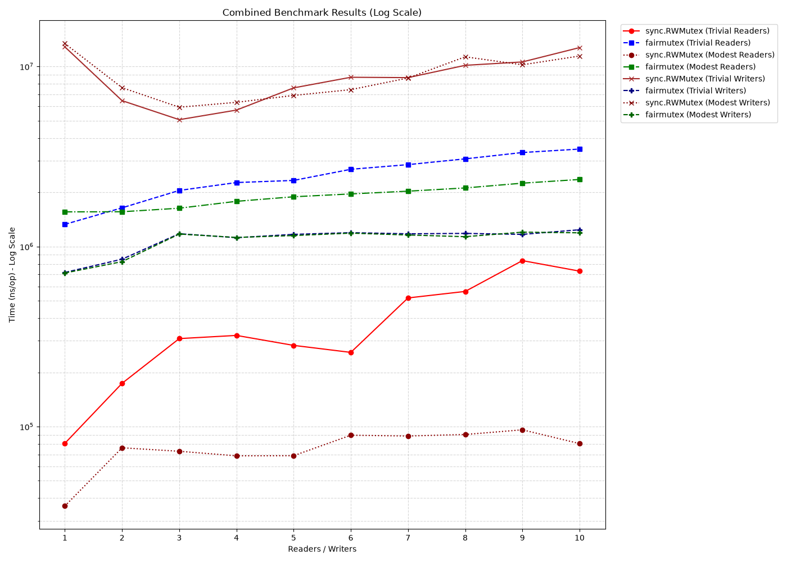
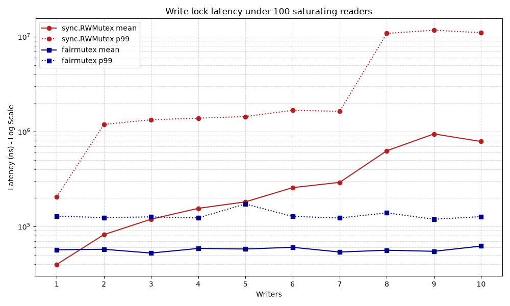
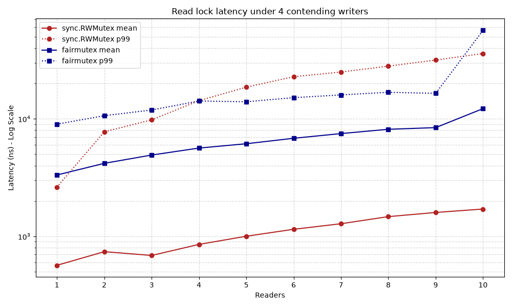

# Fair-Mutex

<div align="center">
  
</div>

[](https://goreportcard.com/report/github.com/fastbean-au/fair-mutex)
[](https://coveralls.io/github/fastbean-au/fair-mutex?branch=main)

[](https://snyk.io/test/github/fastbean-au/fair-mutex)
[](https://pkg.go.dev/github.com/fastbean-au/fair-mutex)


**fair-mutex** is a Fair RW Mutex for Go.

`fair-mutex` is a mutex where write locks will not be significantly delayed in a high volume read-lock use case, while providing a limited guarantee of honouring lock request ordering (see below in [limitations](#limitations)). The larger the number of write locks required under a persistent read lock demand, the larger the performance benefit over `sync.RWMutex` that can be seen (and this is the only scenario where you might see a performance benefit - in **all** other cases `fair-mutex` *will* be less performant).

These are perhaps fairly specific use-cases; if you do not need either of these, then you would perhaps be better off using `sync.RWMutex` or `sync.Mutex` , and if those don't quite meet your needs, then [go-lock](https://github.com/viney-shih/go-lock) might also be an alternative to consider.

This implementation can be used as a *functional* drop-in replacement for Go's [`sync.RWMutex`](https://pkg.go.dev/sync#RWMutex) or [`sync.Mutex`](https://pkg.go.dev/sync#Mutex) as at Go 1.25 (with [limitations](#limitations)).

In addition to supporting the methods provided by `sync.RWMutex`, a helper method `RLockSet(int)` is provided to facilitate requesting a set of read locks in a single batch. It is a run-time error (a panic) to request fewer than one lock.

Two methods, `HasQueueBeenExceeded()` and `HasRQueueBeenExceeded()`, are also made available to assist in identifying when ordering guarantees have not been able to be maintained with the configuration of queue sizes used. If lock request ordering is significant for you, you may wish to check one or both of these methods as applicable either periodically, or at the conclusion of using the mutex to determine if queue sizes need to be increased.

## How it works

The general principle on which `fair-mutex` operates is that locks are given in batches alternating between write locks and read locks when both types of lock requests are queued. When no locks are queued, the first request received of either type becomes the type for that batch.

The batch size is determined at the beginning of a locking cycle, and are simply the lesser of the number of locks queued of the lock type at the beginning of a cycle or the maximum size limit set for that lock type.

Read locks are given concurrently for the entire batch, while write locks are given (and returned) sequentially for the entire batch.

While batches are being processed, both type of lock requests are queued.

Additionally, an OpenTelemetry (OTEL) metric is provided to record the lock wait times, allowing an evaluation of the effective performance of the mutex, and identification of problematic lock contention issues.

### An example

Where R is a R(ead) lock and W is a W(rite) lock request.

Given a starting write lock with lock requests queued as below:

R<sub>1</sub> R<sub>2</sub> R<sub>3</sub> R<sub>4</sub> W<sub>1</sub> W<sub>2</sub> R<sub>5</sub> R<sub>6</sub> R<sub>7</sub> W<sub>3</sub> R<sub>8</sub> W<sub>4</sub> W<sub>5</sub> W<sub>6</sub> R<sub>9</sub> R<sub>10</sub> R<sub>11</sub> R<sub>12</sub> R<sub>13</sub> R<sub>14</sub> W<sub>7</sub> W<sub>8</sub> W<sub>9</sub> W<sub>10</sub> R<sub>15</sub> R<sub>16</sub> R<sub>17</sub>

Locks would expect to be issued as follows once the initial lock is unlocked (the initial lock was a write lock, so the next batch would attempt to be a batch of read locks):

Batch 1: [R<sub>1</sub> R<sub>2</sub> R<sub>3</sub> R<sub>4</sub> R<sub>5</sub> R<sub>6</sub> R<sub>7</sub> R<sub>8</sub> R<sub>9</sub> R<sub>10</sub> R<sub>11</sub> R<sub>12</sub> R<sub>13</sub> R<sub>14</sub> R<sub>15</sub> R<sub>16</sub> R<sub>17</sub>]

Batch 2: [

W<sub>1</sub>

W<sub>2</sub>

W<sub>3</sub>

W<sub>4</sub>

W<sub>5</sub>

W<sub>6</sub>

W<sub>7</sub>

W<sub>8</sub>

W<sub>9</sub>

W<sub>10</sub>

]


## Installation

```bash
go get github.com/fastbean-au/fair-mutex
```

## Static Analysis

A companion static analyzer, `fairmutexcheck`, is included in this repository. It catches common misuse patterns at compile time:

- Direct instantiation (`fairmutex.RWMutex{}`, `&fairmutex.RWMutex{}`, `new(fairmutex.RWMutex)`) instead of `New()`
- Calling `New()` without a corresponding `Stop()` (including `Stop()` called via `defer`, or from a goroutine closure in the same function)

```bash
# Build and run as a standalone checker
go build -o fairmutexcheck ./cmd/fairmutexcheck
./fairmutexcheck ./...

# Or integrate with go vet
go vet -vettool=./fairmutexcheck ./...
```

See [`cmd/fairmutexcheck/README.md`](cmd/fairmutexcheck/README.md) for full details.

## Usage

*Note:* The `New()` function must be called to initialise the mutex prior to use, and the `Stop()` method must be called in order to release the resources associated with the mutex. `Stop()` is idempotent and safe for concurrent use, and does not return until the mutex is fully stopped.

*NB*: Calling any method on the mutex after calling `Stop()` will result in a panic. The mutex should only be stopped once all locks have been released and no lock requests are pending: any request still queued when `Stop()` is called can never be granted, and will panic rather than be left blocked forever.

### Example usage

```go
package main

import (
	"fmt"
	"math/rand/v2"
	"sync"
	"time"

	fairmutex "github.com/fastbean-au/fair-mutex"
)

func main() {

	mtx := fairmutex.New()
	defer mtx.Stop() // Stop the mutex to release the resources

	mtx.Lock()
	// Do something
	mtx.Unlock()

	mtx.RLock()
	// Do something
	mtx.RUnlock()

	if !mtx.TryLock() {
		fmt.Println("Couldn't get a lock")
	} else {
		fmt.Println("Have a lock")
		mtx.Unlock()
	}

	if !mtx.TryRLock() {
		fmt.Println("Couldn't get a read lock")
	} else {
		fmt.Println("Have a read lock")
		mtx.RUnlock()
	}

	wg := new(sync.WaitGroup)

	for range 1000 {
		wg.Add(1)
		go func() {
			defer wg.Done()
			if rand.IntN(5) == 4 {
				mtx.Lock()
				defer mtx.Unlock()
				<-time.After(time.Millisecond)
			} else {
				mtx.RLock()
				defer mtx.RUnlock()
				<-time.After(time.Millisecond)
			}
		}()
	}

	wg.Wait()
}
```

### Example Usage - Ordered Mutex (write locks only)

```go
package main

import (
	"fmt"
	"time"

	fairmutex "github.com/fastbean-au/fair-mutex"
)

func main() {
	mtx := fairmutex.New(fairmutex.WithMaxReadQueueSize(1))
	defer mtx.Stop() // Stop the mutex to release the resources

	// Lock the mutex initially to allow lock requests to be queued
	mtx.Lock()

	for i := 0; i < 10; i++ {
		go func() {
			mtx.Lock()
			defer mtx.Unlock()

			fmt.Println(i)
		}()
	}

	mtx.Unlock()

	// Wait here for a bit to allow the go funcs to acquire and release the locks
	<-time.After(time.Second)
}
```

### Example Usage - Ordered Mutex (read locks only)

*Note:* while read locks are issued in the order requested within the limits of the queue length, if the order is an absolute requirement, the only effective way to achieve it is as below - with a read batch size of 1, which, in effect is the same as using a write lock.

```go
package main

import (
	"fmt"
	"time"

	fairmutex "github.com/fastbean-au/fair-mutex"
)

func main() {
	mtx := fairmutex.New(
			fairmutex.WithMaxReadBatchSize(1),
			fairmutex.WithMaxWriteQueueSize(1),
	)
	defer mtx.Stop() // Stop the mutex to release the resources

	// Lock the mutex initially to allow lock requests to be queued
	mtx.Lock()

	for i := 0; i < 10; i++ {
		go func() {
			mtx.RLock()
			defer mtx.RUnlock()

			fmt.Println(i)
		}()
	}

	mtx.Unlock()

	// Wait here for a bit to allow the go funcs to acquire and release the locks
	<-time.After(time.Second)
}
```

## Limitations

1. Because of the way that `fair-mutex` batches locking, there is a scenario where it can cause a deadlock. This scenario is exposed by the `sync.RWMutex` unit test [doParallelReaders](https://cs.opensource.google/go/go/+/master:src/sync/rwmutex_test.go;l=28) when modified to run `fair-mutex`. Briefly, this occurs when a set of locks must be granted before any locks are released. To overcome this limitation, use the `RLockSet(n)` method to request a set of read locks. No matter how many read locks are requested in a set, only the set itself counts towards the batch limit.

2. Like `sync.Mutex` or `sync.RWMutex`, `fair-mutex` cannot be safely copied at any time. Attempts to copy a `fair-mutex` mutex will be highlighted by `go vet`.

3. The ordering of locks is maintained as long as the number of locks of a type being requested does not exceed the queue size for that type of lock. Once exceeded, the ordering is no longer guaranteed until a new batch begins with the queue not in an overflow state.

4. `TryLock` and `TryRLock` never block waiting for the lock, but their semantics are stricter than `sync.RWMutex`: they succeed only when the mutex is completely free (no locks held and no requests queued), and they may fail spuriously in the instant after the mutex becomes free. In particular, two concurrent `TryRLock` calls will not both succeed, where `sync.RWMutex` would allow both.

## Configuration options

`fair-mutex` provides configurable read and write queue and batch size options, as well as an options for the metric name and default metric attributes.

### WithMaxReadBatchSize
The maximum batch size for read (also known as shared) locks. The batch size does not determine the number of calls to obtain a lock that are waiting, but the maximum number that will be processed in one locking cycle.

This value cannot be larger than the MaxReadQueueSize.

Minimum value of 1.

Defaults to 256.

Under sustained heavy read demand, read batches will fill to this limit, and a queued write lock waits for the current read batch to complete. Reduce this value to bound write lock latency in read-heavy workloads, or increase it to favour read throughput.

### WithMaxReadQueueSize
The maximum queue size for read (also known as shared) locks. The queue size does not determine the number of calls to obtain a lock that are waiting, but the number during which we can guarantee order. This setting will effect the memory required.

Set to 1 if this mutex will only be used as a write-only mutex (read locks are still permissible, but memory is reduced to a minimum).

Values less than 1 are treated as 1.

Defaults to 1024.

### WithMaxWriteBatchSize
The maximum batch size for write (also known as exclusive) locks. The batch size does not determine the number of calls to obtain a lock that are waiting, but the maximum number that will be processed in one locking cycle.

This value cannot be larger than the MaxWriteQueueSize.

Minimum value of 1.

Defaults to 32.

### WithMaxWriteQueueSize
The maximum queue size for write (also known as exclusive) locks. The queue size does not determine the number of calls to obtain a lock that are waiting, but the number during which we can guarantee order. This setting will effect the memory required.

Values less than 1 are treated as 1.

Defaults to 256.

### WithMetricAttributes
A set of attributes with pre-set values to provide on every recording of the mutex lock wait time metric.

### WithMetricName

The name for the metric.

Defaults to "go.mutex.wait.seconds".

## Go Benchmark Results: `sync.RWMutex` vs `fairmutex`

<div align="center">
  
</div>

### Methodology

The benchmarks compare `sync.RWMutex` and `fairmutex` through a typed interface (a single
virtual dispatch per operation for both implementations). Every critical section does real,
fixed-size work *inside* the lock: readers sum a 64-element window of a shared slice, and
writers fill the same window. The shared data does not grow, so the workload is stationary and
runs are comparable.

The latency benchmarks use a single measured goroutine so that ns/op is the cost of one lock
cycle. Every operation is individually timed, and the p50/p99/max latencies are reported
alongside the mean — a fair mutex's value shows in the tail, which a mean alone hides. All
results below are from an Apple M1 (8 cores).

The tables and graphs can be regenerated with [`benchmarking/genreport.py`](benchmarking/genreport.py) (requires matplotlib):

```bash
go test -bench . -run '^$' ./benchmarking/ > bench.out
python3 benchmarking/genreport.py   # writes assets/*.png and tables.md
```

---

#### Uncontended

| Operation | sync.RWMutex (ns/op) | fairmutex (ns/op) |
|-----------|----------------------|-------------------|
| Lock | 19 | 799 |
| RLock | 14 | 804 |

The raw cost of a lock cycle with no contention. This is `sync.RWMutex` at its best: `fairmutex`
pays for its processor round-trip on every operation, a ~40–60x premium.

---

#### Saturated read throughput

| | sync.RWMutex (ns/read) | fairmutex (ns/read) |
|-|------------------------|---------------------|
| All processors reading | 92 | 686 |

Per-read cost with every processor reading concurrently and no writers present — read-dominant
workloads are `sync.RWMutex` home turf, by ~7.5x.

---

#### Write lock latency under saturated reads

The latency of a write lock while 100 spinning readers saturate the mutex, with 0–9 additional
contending writers.

| Writers | sync.RWMutex mean (ns) | sync.RWMutex p99 (ns) | fairmutex mean (ns) | fairmutex p99 (ns) |
|---------|------------------------|-----------------------|---------------------|--------------------|
| 1 | 39,663 | 204,583 | 56,603 | 128,042 |
| 2 | 81,827 | 1,185,333 | 57,349 | 123,708 |
| 3 | 118,901 | 1,328,209 | 52,310 | 125,791 |
| 4 | 154,754 | 1,378,833 | 58,497 | 122,625 |
| 5 | 181,038 | 1,435,375 | 57,673 | 172,125 |
| 6 | 255,674 | 1,668,375 | 60,136 | 127,292 |
| 7 | 290,710 | 1,629,708 | 53,624 | 122,583 |
| 8 | 626,249 | 10,795,458 | 56,026 | 138,666 |
| 9 | 941,922 | 11,649,709 | 54,565 | 118,792 |
| 10 | 783,182 | 10,981,833 | 61,973 | 126,583 |

<div align="center">
  
</div>

This is the scenario `fair-mutex` is designed for. Its mean stays flat at ~55µs and its p99 at
~125µs *regardless of writer count*. `sync.RWMutex` degrades as writers are added: by 8–10
writers its mean is ~0.6–0.9ms, its p99 is ~11ms, and worst-case waits of over 140ms were
observed.

---

#### Read lock latency under contending writes

The latency of a read lock while 4 writers continuously contend, with 0–9 additional readers.

| Readers | sync.RWMutex mean (ns) | sync.RWMutex p99 (ns) | fairmutex mean (ns) | fairmutex p99 (ns) |
|---------|------------------------|-----------------------|---------------------|--------------------|
| 1 | 567 | 2,625 | 3,324 | 9,000 |
| 2 | 740 | 7,750 | 4,178 | 10,625 |
| 3 | 688 | 9,792 | 4,915 | 11,875 |
| 4 | 854 | 14,250 | 5,634 | 14,166 |
| 5 | 1,002 | 18,583 | 6,134 | 13,958 |
| 6 | 1,148 | 22,791 | 6,826 | 15,125 |
| 7 | 1,280 | 25,000 | 7,484 | 15,958 |
| 8 | 1,471 | 28,042 | 8,141 | 16,792 |
| 9 | 1,596 | 31,584 | 8,411 | 16,458 |
| 10 | 1,707 | 35,916 | 12,200 | 56,542 |

<div align="center">
  
</div>

`sync.RWMutex` has the better mean throughout (~0.6–1.7µs vs ~3–12µs). The tail is more even:
from about 5 concurrent readers, `fairmutex`'s p99 is lower than `sync.RWMutex`'s — batching
smooths the reader tail under write pressure too.

---

## Key Observations

### Where `sync.RWMutex` wins

- **Uncontended locks**: ~19ns vs ~800ns — roughly a 40x premium for fairness.
- **Read throughput**: ~7.5x more reads per second under full read parallelism.
- **Mean read latency** under write contention.

### Where `fairmutex` wins

- **Write latency under read saturation** — the headline: mean and p99 are flat as contention
  grows, where `sync.RWMutex`'s p99 reaches ~11ms and its worst case ~140ms. At 9 contending
  writers, `fairmutex`'s p99 is ~90x lower.
- **Predictability**: latencies barely move as contention increases; there is no starvation
  cliff.
- **Read tail latency** under sustained write contention (from ~5 concurrent readers).

### Trade-off Summary

| Scenario                                  | Winner          | Reason |
|-------------------------------------------|-----------------|--------|
| Uncontended or low contention             | `sync.RWMutex`  | ~40x lower per-operation cost |
| Read-dominant workloads                   | `sync.RWMutex`  | ~7.5x higher read throughput |
| Writers under heavy read demand           | `fairmutex`     | Flat ~55µs mean / ~125µs p99; no starvation cliff |
| Tail-latency or fairness-critical mixed   | `fairmutex`     | Bounded, predictable waits for both lock types |

---

**Conclusion**:

Use **`sync.RWMutex`** for **read-dominant** workloads and wherever raw lock overhead matters.

Use **`fairmutex`** where **writers must make timely progress under persistent read demand**,
or where **predictable tail latency** matters more than mean throughput.
